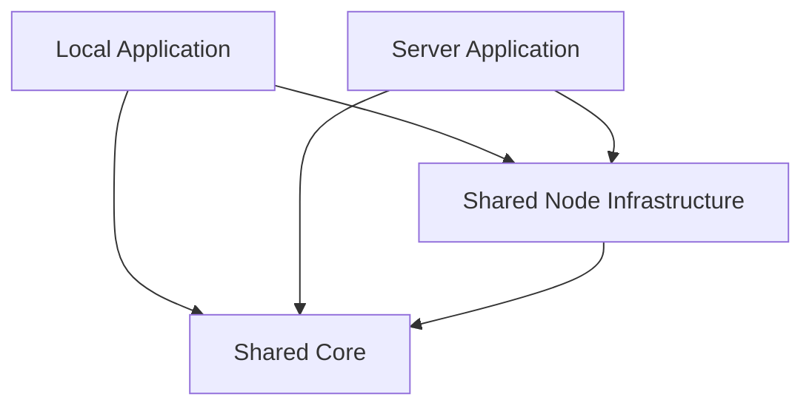

# Wisp Shared Core

| Field | Value |
|---|---|
| Status | Proposed target architecture |
| Scope | Shared domain, application services, contracts, Node infrastructure, and editor UI |
| Consumers | [Local application](./local.md), [Server application](./server.md) |
| Must not depend on | Electron, HTTP, authentication, OIDC, MCP, PostgreSQL, or Docker |

This document describes the target architecture. The current repository does not
yet have this directory structure; the migration inventory maps current functions
to their intended owners.

## Purpose

The shared core contains behavior that must be identical in the local Electron
application and the hosted server application. It is deliberately smaller than
the set of all reusable code.

The core owns:

- vault rules and use cases;
- stable contracts used by UI and host adapters;
- deterministic parsing and transformation logic;
- the shared editor UI;
- platform-neutral error and event models.

The core does not own identity, transport, platform lifecycle, or deployment.

## Dependency Rule



The following imports are forbidden:

```text
shared/core  -> local
shared/core  -> server
shared/core  -> electron
shared/core  -> HTTP framework
shared/core  -> database driver
shared/editor -> Node.js modules
```

Local and server code may depend on the core. The core must never select a host,
discover a user, resolve a server workspace, or send a transport response.

## Ownership Test

A function belongs in the shared core only when all of these statements are true:

1. Its behavior is identical in local and server modes.
2. It does not know whether the caller used IPC, HTTP, WebSocket, or MCP.
3. It does not derive authority from a user-controlled filesystem root.
4. Platform dependencies are supplied through a port or function argument.
5. It represents a domain invariant, shared use case, or shared UI behavior.

Code that is merely convenient to reuse does not automatically belong in the
core. Host policy remains with the host.

## Target Module Layout

```text
src/shared/
  core/
    contracts/
      editor-api.ts
      events.ts
      results.ts
      schemas.ts
    vault/
      types.ts
      paths.ts
      revisions.ts
      tree.ts
      files.ts
      moves.ts
      references.ts
      service.ts
    git/
      types.ts
      status.ts
      diff.ts
      service.ts
    images/
      types.ts
      mime.ts
      references.ts
      service.ts
    reminders/
      types.ts
      recurrence.ts
      normalize.ts
      service.ts
    watcher/
      events.ts
      filters.ts
  node/
    path-guard.ts
    file-limits.ts
    vault-filesystem.ts
    tree-reader.ts
    vault-scanner.ts
  editor/
    app/
    tree/
    editing/
    markdown/
    positions/
    git/
    images/
    reminders/
```

`src/shared/core` is platform-neutral. `src/shared/node` contains concrete Node.js
implementations that are useful to both hosts but are not domain code. Keeping
these directories separate prevents filesystem details from becoming implicit
domain authority.

## Public Contracts

The shared editor talks to a host through one transport-neutral contract:

```ts
export interface EditorHost {
  getCapabilities(): Promise<HostCapabilities>;
  getCurrentWorkspace(): Promise<WorkspaceSummary | null>;
  readTree(): Promise<Result<TreeNode>>;
  readFile(path: VaultPath): Promise<Result<FileDocument>>;
  writeFile(input: WriteFileInput): Promise<Result<FileDocument>>;
  createFile(path: VaultPath): Promise<Result<FileDocument>>;
  createFolder(path: VaultPath): Promise<Result<void>>;
  movePath(input: MovePathInput): Promise<Result<MoveResult>>;
  deletePath(path: VaultPath): Promise<Result<void>>;
  subscribeToChanges(handler: (event: WorkspaceEvent) => void): Unsubscribe;
}
```

Host-only APIs extend this contract outside the shared editor. Login and MCP
token management are not optional methods on `EditorHost`; they belong to the
server shell. Native folder selection and PTY control belong to the local shell.

## Core Types

Types that cross trust boundaries use branded strings so an absolute host path
cannot be confused with a vault-relative path:

```ts
export type WorkspaceId = string & { readonly __brand: 'WorkspaceId' };
export type VaultPath = string & { readonly __brand: 'VaultPath' };
export type Revision = string & { readonly __brand: 'Revision' };
export type AbsoluteHostPath = string & { readonly __brand: 'AbsoluteHostPath' };
```

Network and IPC data also require runtime schemas. TypeScript types alone do not
validate untrusted values.

## Vault Responsibilities

### Domain and application core

The vault core owns:

- normalized, forward-slashed `VaultPath` values;
- tree entry and file document models;
- text and image size policies;
- file revisions and conflict results;
- create, move, rename, and delete use cases;
- Markdown reference preservation after moves;
- ignored-entry policy;
- atomic-write requirements.

The core expresses storage through a port:

```ts
export interface VaultRepository {
  list(path: VaultPath): Promise<VaultEntry[]>;
  read(path: VaultPath): Promise<FileDocument>;
  write(path: VaultPath, content: string): Promise<FileDocument>;
  createFile(path: VaultPath): Promise<FileDocument>;
  createFolder(path: VaultPath): Promise<void>;
  remove(path: VaultPath): Promise<void>;
  move(source: VaultPath, destination: VaultPath): Promise<void>;
  exists(path: VaultPath): Promise<boolean>;
}
```

### Shared Node infrastructure

The shared Node adapter owns:

- `fs` and `fs.promises` calls;
- symlink-aware containment;
- regular-file checks;
- byte limits before reads;
- atomic temporary-file writes and renames;
- directory traversal with depth and count budgets;
- conversion between an authorized root and `VaultPath`.

It receives an already-authorized root. It does not choose that root.

## Revision Invariant

Every read returns a revision. Every potentially concurrent write accepts the
revision that the caller read:

```ts
export interface FileDocument {
  path: VaultPath;
  content: string;
  revision: Revision;
  size: number;
  modifiedAt: string;
}

export interface WriteFileInput {
  path: VaultPath;
  content: string;
  expectedRevision?: Revision;
}
```

The local application may omit `expectedRevision` for its single-user workflow.
The server application must require it for updates. Conflict policy is a host
policy; revision calculation is shared.

## Git Responsibilities

The shared Git core owns:

- porcelain status parsing;
- status kind classification;
- repository-relative path conversion;
- binary detection;
- diff result models;
- pull, commit, push, revert, and diff use-case sequencing;
- the rule that untracked files are never deleted by revert.

Command execution is a port:

```ts
export interface GitRunner {
  run(cwd: AbsoluteHostPath, args: readonly string[], options?: GitRunOptions): Promise<GitRunResult>;
}
```

The local runner owns desktop PATH and Flatpak behavior. The server runner owns
credentials, isolation, output limits, and workspace locks.

## Image Responsibilities

The shared image core owns:

- supported extensions and MIME mapping;
- safe destination-name generation;
- Markdown image reference generation;
- image size and type policy;
- image metadata returned to the editor.

The local adapter imports from an Electron-provided source path. The server
adapter imports a streamed upload. The core never accepts a browser-supplied
absolute path.

## Reminder Responsibilities

The shared reminder core owns:

- reminder and repeat-rule types;
- normalization;
- local date/time conversion;
- monthly and yearly anchor behavior;
- next-occurrence calculation;
- complete, snooze, and remap use cases.

Persistence is a port. Local uses `.wisp-reminders.json`; server may use
PostgreSQL when reliable scheduling and per-user reminders are implemented.

## Watcher Responsibilities

The core owns the event model and ignored-path filtering:

```ts
export interface WorkspaceEvent {
  workspaceId: WorkspaceId;
  sequence: number;
  kind: 'created' | 'changed' | 'deleted' | 'moved' | 'resync-required';
  path?: VaultPath;
  operationId?: string;
}
```

Local owns a single active watcher and IPC delivery. Server owns watchers per
active workspace, subscriber fan-out, reconnect behavior, and event sequences.

## Shared Editor

The editor is browser code shared by both products. It owns:

- raw, WYSIWYG, preview, image, and diff panes;
- Markdown rendering, sanitization, and folding;
- table and block formatting;
- find and replace;
- reading positions;
- tree and recent-file rendering;
- git diff presentation;
- image insertion after an image has been imported;
- reminder editing and display;
- layout and dialogs.

The shared editor must not own:

- login or logout;
- OIDC redirects;
- native folder selection;
- Electron window behavior;
- HTTP cookies or CSRF;
- MCP token administration;
- local Claude process lifecycle.

Optional host features are exposed through capabilities, not scattered
`if (isServer)` checks.

## Host Capabilities

```ts
export interface HostCapabilities {
  chooseLocalFolder: boolean;
  revealInFileManager: boolean;
  synchronousCloseSave: boolean;
  git: boolean;
  localClaude: boolean;
  interactiveTerminal: boolean;
  imageAnalysis: boolean;
}
```

Authentication and account management are intentionally absent. They belong to
the web shell, not the editor capability model.

## Error Model

Expected failures are typed results rather than thrown transport errors:

```ts
export type Result<T> =
  | { ok: true; value: T }
  | { ok: false; error: AppError };

export type AppError =
  | { code: 'not-found'; message: string }
  | { code: 'invalid-path'; message: string }
  | { code: 'conflict'; message: string; currentRevision: Revision }
  | { code: 'too-large'; message: string; limit: number }
  | { code: 'unsupported'; message: string };
```

Authorization errors are server errors and do not originate in the shared core.

## Current-to-Target Function Inventory

| Current function or area | Target owner | Target module |
|---|---|---|
| `isIgnored` | Core | `shared/core/vault/tree.ts` |
| `formatBytesLimit` | Core | `shared/core/vault/files.ts` |
| `isInside` | Core | `shared/core/vault/paths.ts` |
| `realpathExisting` | Shared Node | `shared/node/path-guard.ts` |
| `assertInsideVault` | Shared Node | `shared/node/path-guard.ts` |
| `assertReadableFile` | Shared Node | `shared/node/file-limits.ts` |
| `vaultPath` | Shared Node | `shared/node/vault-filesystem.ts` |
| `mtimeOf`, `buildTree` | Shared Node | `shared/node/tree-reader.ts` |
| file CRUD handler bodies | Core + Shared Node | `vault/service.ts`, `vault-filesystem.ts` |
| Markdown reference helpers | Core | `shared/core/vault/references.ts` |
| `updateRefsAfterMove` | Core use case | `shared/core/vault/moves.ts` |
| `statusKind`, `parseStatus` | Core | `shared/core/git/status.ts` |
| Git operation sequencing | Core | `shared/core/git/service.ts` |
| `isBinaryBuffer` | Core | `shared/core/git/diff.ts` |
| MIME and image reference rules | Core | `shared/core/images/*` |
| reminder recurrence math | Core | `shared/core/reminders/recurrence.ts` |
| reminder normalization | Core | `shared/core/reminders/normalize.ts` |
| watcher filtering | Core | `shared/core/watcher/filters.ts` |
| `renderer/lcs.js` | Shared editor | `shared/editor/editing/lcs.ts` |
| Markdown fold and rendering | Shared editor | `shared/editor/markdown/*` |
| reading position mappings | Shared editor | `shared/editor/positions/*` |
| tree rendering and recency | Shared editor | `shared/editor/tree/*` |

## Explicit Exclusions

The following never belong in the shared core:

- Electron application lifecycle and menu construction;
- browser login pages and account screens;
- session cookies and CSRF;
- OIDC provider configuration;
- server workspace membership checks;
- MCP bearer-token validation;
- database queries and migrations;
- Flatpak host process spawning;
- local Claude prompts and CLI execution;
- PTY ownership;
- Docker and reverse-proxy configuration.

## Test Strategy

The core requires:

- unit tests for pure parsers and transformations;
- property tests for path normalization and containment;
- contract tests for `VaultRepository`, `GitRunner`, and `EditorHost`;
- fixture tests for Markdown reference rewrites;
- recurrence tests across DST, leap years, and month ends;
- adapter tests against temporary real filesystems;
- the existing Electron smoke suite as a regression gate.

The same `EditorHost` contract suite must run against Electron IPC and the web
HTTP/WebSocket adapter.

## Architecture Enforcement

CI must fail when:

- shared core imports local or server modules;
- shared editor imports Node.js or Electron;
- a host adapter bypasses its application service;
- server or MCP code passes an unvalidated absolute path into storage;
- public request types lack runtime schemas;
- Electron packaging omits a required shared module.

These checks should extend the repository's existing TypeScript and Acorn checks.

## Migration Order

1. Introduce strict TypeScript contracts while retaining `allowJs` for legacy code.
2. Extract pure path, reference, Git parser, and reminder functions.
3. Define repository and runner ports.
4. Extract shared Node filesystem implementations.
5. Replace IPC handler bodies with calls to shared application services.
6. Split the renderer by feature without changing behavior.
7. Run local smoke tests after every extraction.
8. Add the server host only after the local host uses the shared contracts.

## Review Checklist

For every new function, ask:

1. Is the behavior identical in both products?
2. Does it require a user, session, window, transport, process, or database?
3. Is it a domain rule, an application use case, or an adapter detail?
4. Can its side effects be represented behind an existing port?
5. Would placing it in the core weaken a host-specific security boundary?

If the function requires identity, transport, or platform lifecycle, it does not
belong in the shared core.
