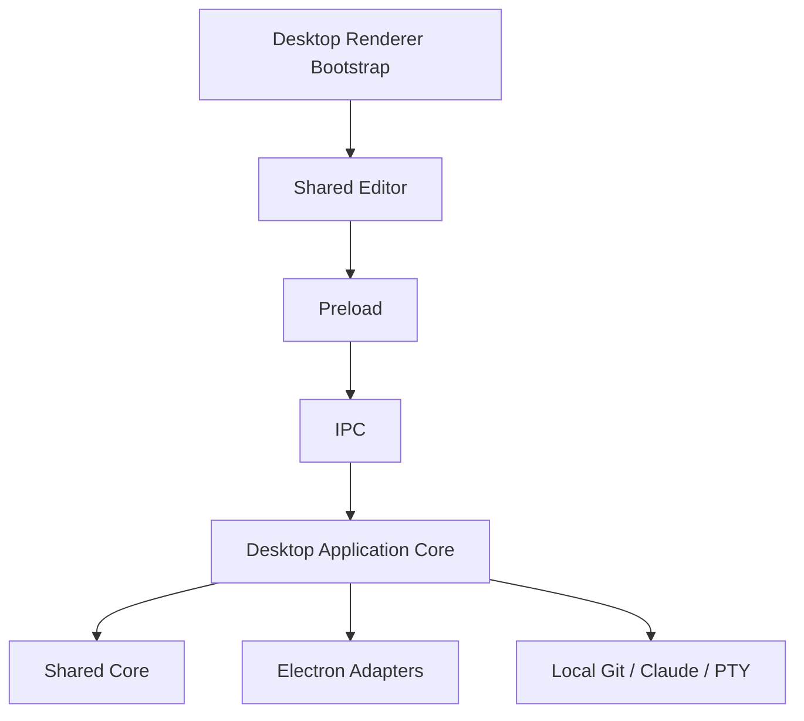

# Wisp Local Application

| Field | Value |
|---|---|
| Status | Proposed target architecture |
| Runtime | Electron desktop application |
| Data | User-selected local vaults |
| Authentication | None |
| Shared dependency | [Wisp Shared Core](./core.md) |
| Server counterpart | [Wisp Server Application](./server.md) |

This document defines the local product boundary. The local application remains
a complete, independent desktop application. It must not require a server,
database, account, or network connection.

## Purpose

The local application owns behavior that is meaningful only on the user's
computer:

- selecting an arbitrary local vault;
- native window and menu lifecycle;
- opening Finder or the platform file manager;
- local Git and Claude CLI execution;
- the interactive Claude PTY;
- macOS and Linux packaging.

It composes shared vault and editor services with Electron adapters.

## Architecture



## Dependency Rules

The local application may depend on:

- shared core contracts and services;
- shared Node infrastructure;
- Electron;
- `node-pty`;
- Node.js standard libraries.

The local application must not depend on:

- server authentication;
- OIDC;
- HTTP route handlers;
- PostgreSQL;
- MCP server code;
- server workspace membership;
- Docker runtime configuration.

## Target Module Layout

```text
src/local/
  main.ts
  preload.ts
  application/
    local-application.ts
    local-vault-session.ts
    capabilities.ts
  electron/
    protocol.ts
    window.ts
    window-state.ts
    menu.ts
    dialogs.ts
    shell.ts
    notifications.ts
  ipc/
    register.ts
    files.ts
    git.ts
    images.ts
    reminders.ts
    smart.ts
    terminal.ts
    watcher.ts
  processes/
    environment.ts
    flatpak-host.ts
    git-runner.ts
    claude-runner.ts
  terminal/
    session.ts
  watcher/
    session.ts
  config/
    store.ts
  renderer/
    bootstrap.ts
    local-shell.ts
```

The name `local` is used for product ownership. Electron-specific details remain
inside `local/electron`, so the application core can be tested without Electron.

## Composition Root

`src/local/main.ts` constructs the application. It should describe dependencies,
not implement features:

```ts
const vaultRepository = createNodeVaultRepository();
const vaultService = createVaultService({ vaultRepository });
const gitRunner = createLocalGitRunner({ processEnvironment, flatpakHost });
const gitService = createGitService({ gitRunner, vaultRepository });
const watcher = createLocalWatcher();
const terminal = createLocalClaudeTerminal();

const application = createLocalApplication({
  vaultService,
  gitService,
  watcher,
  terminal,
  configStore,
});

registerIpcHandlers(ipcMain, application);
await createWindow(application);
```

The composition root is the only place where all local adapters meet.

## Local Application Core

The local application core owns:

- the currently selected local vault root;
- local vault session lifecycle;
- desktop capability selection;
- coordination between watcher, terminal, and vault changes;
- translation between absolute local paths and shared `VaultPath` values;
- local config persistence commands;
- desktop-specific close and shutdown behavior.

It must not contain Electron IPC calls. IPC is an inbound adapter.

## Electron Shell

### Protocol

The custom `app://` protocol serves only packaged UI assets. Path containment and
content types remain explicit.

Target owner:

```text
registerAppProtocol -> local/electron/protocol.ts
APP_SCHEME          -> local/electron/protocol.ts
CONTENT_TYPE        -> local/electron/protocol.ts
```

### Window and state

Window geometry and visibility are local concerns:

```text
loadConfig
saveConfig
restoredWindowState
persistWindowState
scheduleWindowStateSave
createWindow
```

Target modules:

```text
local/config/store.ts
local/electron/window-state.ts
local/electron/window.ts
```

### Menu and native shell

The local shell owns:

```text
buildMenu
openExternal through Electron shell
revealPath through Electron shell
alertWindow
native folder picker
```

The shared editor sees these only through capabilities and host methods.

## IPC and Preload

Preload remains a hand-written allowlist. It exposes the local `EditorHost` and
local optional capabilities, never a generic IPC invoke function.

IPC modules are thin adapters:

```ts
export function registerFileHandlers(
  ipcMain: Electron.IpcMain,
  application: LocalApplication,
): void;
```

An IPC handler may:

- decode and validate its transport arguments;
- call one application method;
- convert the application result to the IPC result envelope.

An IPC handler must not:

- perform filesystem operations directly;
- spawn Git or Claude directly;
- duplicate path guards;
- own watcher or PTY state;
- contain business rules.

## Local Vault Selection

The local folder picker returns an absolute OS path. The local application turns
it into a `LocalVaultSession`:

```ts
export interface LocalVaultSession {
  root: AbsoluteHostPath;
  displayName: string;
  toVaultPath(path: AbsoluteHostPath): VaultPath;
  toAbsolutePath(path: VaultPath): AbsoluteHostPath;
}
```

Absolute paths do not cross into the shared editor after the migration. This
keeps the editor contract identical to the server contract.

## Local Capabilities

```ts
export const localCapabilities: HostCapabilities = {
  chooseLocalFolder: true,
  revealInFileManager: true,
  synchronousCloseSave: true,
  git: true,
  localClaude: true,
  interactiveTerminal: true,
  imageAnalysis: true,
};
```

Login and account management are absent rather than disabled capabilities.

## Local Process Execution

### Environment

The local process adapter owns:

- CLI search-path extensions;
- Finder/Dock bare-PATH handling;
- Git prompt suppression;
- selected Claude environment forwarding;
- timeouts and process output limits.

Current functions moving here:

```text
cliPathExtras
claudeEnv
gitEnv
hostCliEnv
```

### Flatpak host bridge

Flatpak execution is local packaging policy:

```text
hostCommand
hostSearchPath
flatpak-spawn argument construction
```

It must not appear in shared Git or Claude services.

### Git runner

`LocalGitRunner` implements the shared `GitRunner` port. It supplies local PATH,
Flatpak host execution, prompt suppression, and local credentials.

### Claude runner

The local Claude runner owns:

```text
runClaude
buildInsertPrompt
buildLookupPrompt
buildImagePrompt
describeNow
extractJson for Claude envelopes
sanitizeSources
sanitizeAnalysis
```

These remain local because the planned server does not invoke a model. A future
server-side model integration would introduce a separate server adapter rather
than reuse local CLI process policy.

## Interactive Terminal

The local terminal owns:

- lazy `node-pty` loading;
- one PTY per Electron window;
- fixed `claude` command selection;
- dimension validation;
- resize and input forwarding;
- process replacement and shutdown;
- output and exit events to the renderer.

Current functions moving here:

```text
loadPty
ptyDimension
killPty
term-start
term-input
term-resize
term-stop
```

The renderer never supplies an executable name.

## Local Watcher

The local watcher owns one active `fs.watch` session because there is one window
and one open vault:

```text
noteOwnWrite
stopVaultWatch
onVaultEvent
watch-vault lifecycle
```

Ignored-path rules and event types are shared. IPC delivery and recent-own-write
suppression are local policies.

## Image Import

Electron drag-and-drop exposes a local source path through
`webUtils.getPathForFile`. The local image adapter:

1. validates the source as a regular file;
2. applies shared image size and MIME policy;
3. streams or copies it into the vault repository;
4. returns a shared image result with a `VaultPath` and Markdown reference.

The shared image service does not know the original absolute source path.

## Local Persistence

| Data | Storage |
|---|---|
| Notes and images | Selected local vault |
| Reminders | `.wisp-reminders.json` in the vault |
| Last vault | Electron `userData/config.json` |
| Window geometry | Electron `userData/config.json` |
| Editor preferences | Renderer `localStorage` |
| Reading positions | Renderer `localStorage` keyed by stable local vault identity |

The local application must start and operate when no database or server
configuration exists.

## Renderer Bootstrap

The local renderer bootstrap supplies the preload-backed `EditorHost`, local
capabilities, and local shell controls before mounting the shared editor.

Local-only UI modules include:

- folder welcome and change-folder actions;
- terminal pane and shortcut;
- smart insert and lookup controls;
- local image analysis state;
- reveal-in-file-manager menu entry.

The shared editor must remain usable when those modules are absent.

## Security Boundary

```text
Shared renderer
  -> context-isolated preload
  -> hand-listed IPC channel
  -> LocalApplication
  -> authorized LocalVaultSession
  -> shared service / local adapter
```

The renderer has no direct Node.js access. All filesystem targets still pass
through symlink-aware vault containment.

## Packaging

The local product continues to publish:

- macOS arm64 DMG and ZIP;
- Linux x86_64 AppImage;
- Linux x86_64 tar.gz;
- Linux x86_64 deb;
- Linux x86_64 single-file Flatpak bundle.

Electron packaging must include local and shared runtime output only. It must not
include server authentication, database migrations, MCP routes, or Docker files.

## Explicit Exclusions

The local application never owns:

- users, organizations, or memberships;
- login, logout, or password reset;
- OIDC identities;
- session cookies or CSRF;
- PostgreSQL;
- remote MCP endpoints;
- server workspace IDs or quotas;
- Docker health and readiness endpoints.

## Current-to-Target Function Inventory

| Current function or area | Target module |
|---|---|
| `registerAppProtocol` | `local/electron/protocol.ts` |
| config load/save | `local/config/store.ts` |
| window restore and persistence | `local/electron/window-state.ts` |
| `createWindow` | `local/electron/window.ts` |
| `buildMenu` | `local/electron/menu.ts` |
| bare `ipcMain` registrations | feature files under `local/ipc/` |
| generic typed `handle` wrapper | `local/ipc/register.ts` |
| folder picker | `local/electron/dialogs.ts` |
| reveal and external links | `local/electron/shell.ts` |
| window alert | `local/electron/notifications.ts` |
| Flatpak process bridge | `local/processes/flatpak-host.ts` |
| local process environment | `local/processes/environment.ts` |
| local Git process | `local/processes/git-runner.ts` |
| local Claude process and prompts | `local/processes/claude-runner.ts` |
| PTY globals and handlers | `local/terminal/session.ts` |
| watcher globals and delivery | `local/watcher/session.ts` |
| `preload.js` | `local/preload.ts` |

## Test Strategy

The local application requires:

- unit tests for window-state restoration and process argument construction;
- IPC adapter tests against a fake `LocalApplication`;
- contract tests for `LocalGitRunner` and local `EditorHost`;
- Flatpak host-command tests;
- PTY lifecycle tests;
- the existing source and packaged Electron smoke suites;
- package-content tests proving server code is absent;
- release artifact checks for every configured platform target.

## Migration Order

1. Extract Electron protocol, config, window, and menu without behavior changes.
2. Extract IPC registration by feature while retaining channel names.
3. Extract local process and Flatpak policy from Git and Claude logic.
4. Introduce `LocalVaultSession` and map absolute paths at the host boundary.
5. Make IPC delegate to shared services.
6. Add local capabilities and split local-only renderer features.
7. Convert extracted modules to strict TypeScript.
8. Keep every existing Electron smoke assertion as a migration gate.
