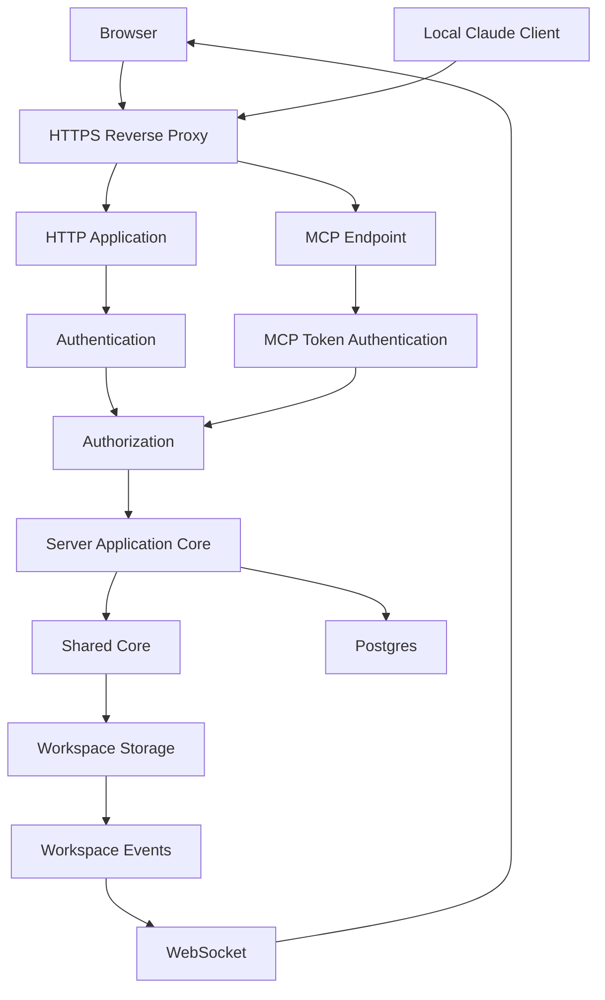

# Wisp Server Application

| Field | Value |
|---|---|
| Status | Proposed target architecture |
| Runtime | Node.js in Docker |
| Data | Server-owned, isolated workspace volumes |
| Authentication | Local accounts and OIDC |
| Claude integration | Authenticated remote MCP endpoint for a local Claude client |
| Shared dependency | [Wisp Shared Core](./core.md) |
| Local counterpart | [Wisp Local Application](./local.md) |

This document describes a self-hosted, multi-user server. The first version uses
private workspaces and does not run Claude or an interactive PTY on the server.

## Purpose

The server application hosts the shared editor over HTTPS and binds every
operation to an authenticated principal and an authorized workspace.

It owns:

- local user accounts and OIDC identities;
- sessions, roles, and workspace membership;
- server-side workspace roots;
- HTTP and WebSocket transports;
- MCP token authentication and tools;
- PostgreSQL persistence;
- concurrency, quotas, and audit logging;
- Docker lifecycle and operational health.

## Architecture



## Dependency Rules

The server may depend on:

- shared core and shared Node infrastructure;
- HTTP and WebSocket libraries;
- runtime validation schemas;
- PostgreSQL;
- OIDC and password-hashing libraries;
- MCP protocol libraries.

The server must not depend on:

- Electron;
- preload or IPC;
- native folder dialogs;
- Finder or desktop shell APIs;
- local Claude CLI configuration;
- `node-pty` in the first server release;
- Flatpak host execution.

## Target Module Layout

```text
src/server/
  index.ts
  application/
    server-application.ts
    request-context.ts
    authorization.ts
    workspace-service.ts
    file-service.ts
    git-service.ts
    user-service.ts
    token-service.ts
  auth/
    local-auth.ts
    password-hasher.ts
    oidc.ts
    account-linking.ts
    sessions.ts
    csrf.ts
    rate-limit.ts
  http/
    app.ts
    middleware/
      authentication.ts
      authorization.ts
      validation.ts
      errors.ts
    routes/
      session.ts
      users.ts
      workspaces.ts
      files.ts
      images.ts
      reminders.ts
      git.ts
      tokens.ts
  websocket/
    upgrade.ts
    connection.ts
    workspace-events.ts
  mcp/
    endpoint.ts
    authentication.ts
    tools.ts
    schemas.ts
  persistence/
    database.ts
    migrations/
    users.ts
    identities.ts
    sessions.ts
    workspaces.ts
    memberships.ts
    tokens.ts
    audit.ts
  storage/
    workspace-resolver.ts
    workspace-repository.ts
    upload.ts
    locks.ts
  events/
    watcher-manager.ts
    event-sequence.ts
    subscriber-registry.ts
  operations/
    health.ts
    readiness.ts
    shutdown.ts
```

## Composition Root

`src/server/index.ts` constructs server dependencies:

```ts
const database = await connectDatabase(config.databaseUrl);
const sessionStore = createSessionStore(database);
const workspaceRepository = createWorkspaceRepository(database);
const workspaceResolver = createWorkspaceResolver(config.dataRoot, workspaceRepository);
const vaultRepository = createNodeVaultRepository();
const vaultService = createVaultService({ vaultRepository });
const authorization = createAuthorizationService(database);
const auditLog = createAuditLog(database);

const application = createServerApplication({
  authorization,
  workspaceResolver,
  vaultService,
  auditLog,
});

const http = createHttpApplication({ application, authentication, csrf });
const websocket = createWebSocketServer({ application, sessionStore });
const mcp = createMcpEndpoint({ application, tokenService });
```

Routes, WebSockets, and MCP all call the same server application core. None may
bypass authorization by calling storage directly.

## Request Context

Every server application call receives a trusted context produced after
authentication and authorization:

```ts
export interface RequestContext {
  requestId: string;
  principal: Principal;
  workspace: AuthorizedWorkspace;
  sessionId?: SessionId;
  tokenId?: TokenId;
}
```

The browser may request a `WorkspaceId`. Only the server may turn it into an
`AuthorizedWorkspace` and an absolute storage root.

## Authentication

### Local accounts

The first release supports administrator-created local users:

- no public registration by default;
- Argon2id password hashes;
- login rate limiting;
- secure server-side sessions;
- administrator password reset;
- session listing and revocation;
- optional account disablement;
- bootstrap administrator created once during initial setup.

Authentication cookies must be:

```text
HttpOnly
Secure
SameSite=Lax
Path=/
```

State-changing HTTP requests also require CSRF and `Origin` validation.

### OIDC

OIDC uses Authorization Code Flow with PKCE. The server stores provider subject
identifiers rather than treating an email address as identity.

Account linking must be explicit. Matching email addresses are not sufficient to
link a local account and an OIDC account automatically.

### Sessions

Sessions are opaque, random, server-side records. They support:

- idle and absolute expiry;
- rotation after login and privilege changes;
- revocation on logout, password reset, or account disablement;
- audit records for creation and revocation.

Browser authentication tokens are never stored in `localStorage`.

## Authorization

Initial workspace roles:

| Role | Read | Write | Reminders | Git read | Git mutate | Tokens | Members |
|---|---:|---:|---:|---:|---:|---:|---:|
| Viewer | yes | no | no | optional | no | no | no |
| Editor | yes | yes | yes | yes | no | no | no |
| Maintainer | yes | yes | yes | yes | yes | no | no |
| Owner | yes | yes | yes | yes | yes | yes | yes |

Every application method names the required permission. UI visibility is not an
authorization control.

## Users and Workspaces

The target data model contains:

```text
users
identities
sessions
workspaces
workspace_memberships
api_tokens
audit_events
```

The first product version creates one private workspace for each user. The
membership model is retained so explicit sharing can be added without changing
the storage authority model.

## Workspace Storage

Workspace files live under a server-controlled root:

```text
/data/workspaces/<workspace-uuid>/vault/
```

Rules:

1. The client never sends `baseFolder` or an absolute path.
2. The server resolves `WorkspaceId` through membership.
3. The resolver derives the absolute root from trusted database state.
4. Shared storage converts only validated `VaultPath` values under that root.
5. Symlink-aware containment remains mandatory.
6. Server processes must not mount sibling host directories unnecessarily.

The API never returns absolute server paths.

## File Revisions and Concurrency

The server requires `expectedRevision` for updates to existing files. A mismatch
returns an application conflict translated to HTTP `409 Conflict`.

Move, rename, delete, Git mutation, and multi-file reference rewrites are
serialized per workspace. The first deployment can use a process-local mutex
because it runs one application replica. A multi-replica deployment requires a
lease or database-backed lock with fencing.

Writes use temporary files in the same directory followed by atomic rename.

## HTTP API

The initial same-origin API is versioned under `/api/v1`:

```text
GET    /api/v1/session
POST   /api/v1/login
POST   /api/v1/logout
GET    /api/v1/workspaces
GET    /api/v1/workspaces/:id/tree
GET    /api/v1/workspaces/:id/files/:encodedPath
PUT    /api/v1/workspaces/:id/files/:encodedPath
POST   /api/v1/workspaces/:id/files
POST   /api/v1/workspaces/:id/moves
DELETE /api/v1/workspaces/:id/files/:encodedPath
POST   /api/v1/workspaces/:id/images
GET    /api/v1/workspaces/:id/git/status
GET    /api/v1/workspaces/:id/git/diff
POST   /api/v1/workspaces/:id/git/pull
POST   /api/v1/workspaces/:id/git/commit
GET    /api/v1/account/tokens
POST   /api/v1/account/tokens
DELETE /api/v1/account/tokens/:tokenId
```

Request schemas validate path form, size limits, identifiers, revisions, and
enumerations at runtime. TypeScript types are derived from those schemas.

The deployment is same-origin by default. CORS is disabled unless an explicit
deployment requirement introduces a separate origin.

## WebSocket Events

WebSockets initially carry workspace changes only. Upgrade handling must:

- authenticate the session cookie;
- validate the exact browser `Origin`;
- authorize every workspace subscription;
- cap message and connection counts;
- use heartbeats and idle cleanup;
- include event sequence numbers;
- force a resync after a sequence gap.

The server does not expose a remote terminal in the first version.

## MCP Endpoint

Wisp acts as a remote MCP server. A locally running Claude client connects over
HTTPS with a personal bearer token:

```text
Local Claude
  -> Authorization: Bearer <token>
  -> https://wisp.example/mcp
  -> token authentication
  -> workspace authorization
  -> ServerApplication
  -> shared vault use case
```

MCP does not let the web UI invoke the local Claude process. It lets the local
Claude client invoke Wisp tools.

### Token policy

MCP tokens:

- are shown in plaintext only once;
- are stored as hashes;
- have an expiry and explicit revocation;
- are scoped to one user and selected workspaces;
- use permissions such as `workspace:read` and `workspace:write`;
- record creation, last use, and revocation;
- are distinct from browser session cookies.

### Initial tools

```text
list_notes
search_notes
read_note
create_note
update_note
move_note
list_reminders
create_reminder
```

`update_note` requires `expectedRevision`. Destructive delete and Git mutation
tools are deferred until confirmation and audit semantics are established.

MCP tools call the server application layer. They never call the filesystem or
database repository directly.

## Git

Server Git operates on the authorized workspace repository. It requires:

- one repository root per workspace;
- mutation serialization;
- fixed executable and argument construction without a shell;
- command timeout and output byte limits;
- controlled environment and `HOME`;
- disabled repository hooks by policy;
- explicit credential configuration;
- audit events for pull, commit, push, and revert.

Git credentials are encrypted at rest and exposed only to the Git runner. Tokens
must not appear in command arguments, remote URLs, or logs.

## Images

Browser drag-and-drop sends image bytes, not a client filesystem path. The server
upload adapter:

- streams multipart uploads;
- caps bytes before buffering;
- verifies MIME using file bytes;
- applies image dimension and pixel limits;
- creates destination names atomically;
- writes through the authorized vault repository;
- serves authenticated image responses with `nosniff`.

The first version does not analyze images with Claude on the server.

## Reminders

For initial feature parity, reminder editing may continue through the shared
reminder model. Reliable reminders while no browser is open require a later
server scheduler and PostgreSQL-backed occurrence state.

The long-term server design owns:

- per-user reminder assignment;
- timezone-aware due times;
- idempotent occurrence delivery;
- Web Push or email channels;
- scheduler leases and retries.

This does not change the local `.wisp-reminders.json` format.

## Audit Logging

Audit events record security-relevant actions without storing note content by
default:

```text
login success/failure
session revoke
OIDC account link
user create/disable
workspace membership change
MCP token create/revoke/use
file create/move/delete
Git mutation
authorization denial
```

Each event includes request ID, actor, workspace, operation, result, timestamp,
and safe metadata.

## Security Requirements

The server requires:

- HTTPS in non-development deployments;
- secure cookies and CSRF protection;
- exact `Origin` validation for HTTP mutations and WebSockets;
- no wildcard credentialed CORS;
- CSP, `nosniff`, frame denial, and strict referrer policy;
- rate limits for login, uploads, MCP, and expensive scans;
- workspace quotas for bytes, files, and traversal depth;
- non-root containers with dropped capabilities;
- read-only container root filesystem;
- no Docker socket or host home mounts;
- secret redaction in logs;
- database migrations before readiness;
- graceful shutdown of watchers and WebSockets.

## Persistence

| Data | Store |
|---|---|
| Users and identities | PostgreSQL |
| Sessions | PostgreSQL initially |
| Workspaces and memberships | PostgreSQL |
| MCP tokens | Hashed values in PostgreSQL |
| Audit events | PostgreSQL or append-oriented log sink |
| Notes and images | Workspace volumes |
| UI preferences | Browser storage initially, optional DB later |
| Git credentials | Encrypted records or external secret store |

Git remotes are not backups. Workspace volumes and PostgreSQL require coordinated,
encrypted, off-host backups and documented restore tests.

## Docker Deployment

Initial Compose topology:

```text
reverse-proxy
wisp-server
postgres
workspace-volume
backup-agent
```

The Wisp image contains server runtime output and web assets only. It must not
contain Electron, desktop preload, native desktop packaging resources, or local
Claude configuration.

Required endpoints:

```text
GET /healthz   process is alive
GET /readyz    database and migrations are ready
```

## Explicit Exclusions

The first server release does not own:

- local filesystem selection from the browser;
- access to browser client paths;
- Finder or desktop shell integration;
- local Claude CLI execution;
- web-triggered local Claude jobs;
- interactive remote PTY;
- shared real-time collaborative editing;
- public self-registration;
- automatic account linking by email;
- multi-replica workspace locking.

## Current-to-Target Function Inventory

No server implementation exists yet. The server will reuse shared behavior after
it has been extracted from `main.js`.

| Planned function or area | Target module |
|---|---|
| local account login | `server/auth/local-auth.ts` |
| password hashing | `server/auth/password-hasher.ts` |
| OIDC flow | `server/auth/oidc.ts` |
| session lifecycle | `server/auth/sessions.ts` |
| CSRF and request origin checks | `server/auth/csrf.ts` |
| workspace authorization | `server/application/authorization.ts` |
| server root resolution | `server/storage/workspace-resolver.ts` |
| HTTP file transport | `server/http/routes/files.ts` |
| upload transport | `server/storage/upload.ts` |
| WebSocket upgrade and subscriptions | `server/websocket/*` |
| MCP token validation | `server/mcp/authentication.ts` |
| MCP tools | `server/mcp/tools.ts` |
| workspace mutation lock | `server/storage/locks.ts` |
| audit persistence | `server/persistence/audit.ts` |
| readiness and shutdown | `server/operations/*` |

## Test Strategy

The server requires:

- unit tests for authorization and account linking;
- password and session lifecycle tests;
- HTTP schema and CSRF tests;
- IDOR tests proving user A cannot access user B's workspace;
- path traversal and symlink escape tests;
- file revision and conflict tests;
- WebSocket authentication and origin tests;
- MCP token scope, expiry, and revocation tests;
- MCP revision-conflict tests;
- upload size and MIME tests;
- Git lock and credential-redaction tests;
- migration tests against a real PostgreSQL instance;
- Docker integration tests from login through file editing;
- package-content tests proving Electron is absent.

## Delivery Phases

1. Extract and type the shared core while preserving local behavior.
2. Add a development-only single-workspace HTTP adapter on loopback.
3. Add PostgreSQL, local accounts, sessions, and private workspaces.
4. Add browser revision conflicts and WebSocket change events.
5. Add OIDC and explicit account linking.
6. Add MCP tokens and read-only tools.
7. Add revision-protected MCP write tools and audit events.
8. Add Docker hardening, backup tooling, and release CI.
9. Consider server reminders, sharing, and isolated terminals only after the first release is stable.
